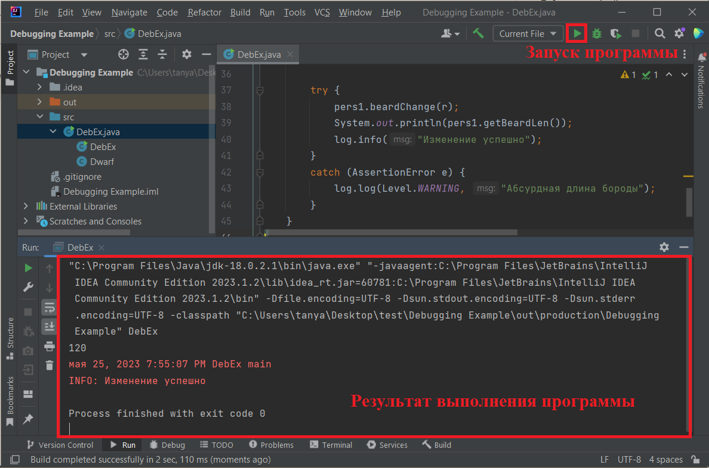
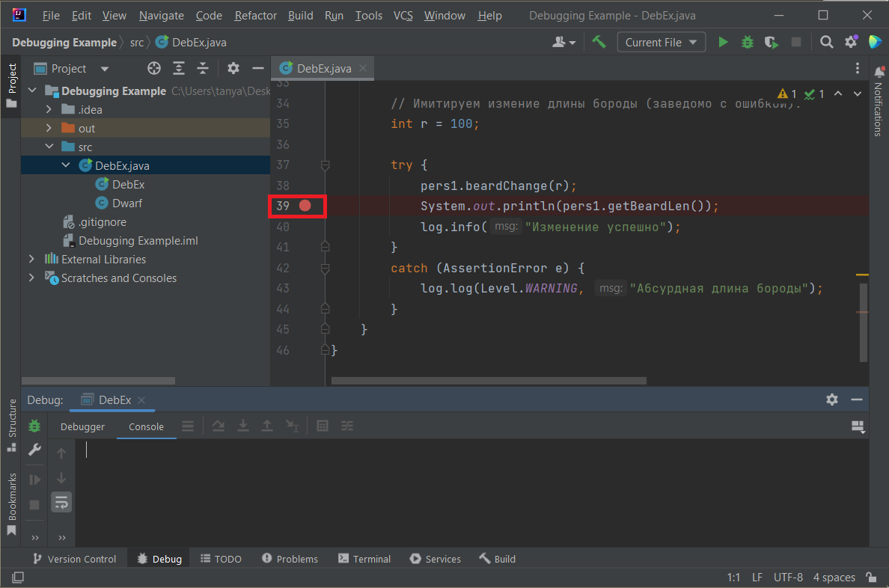
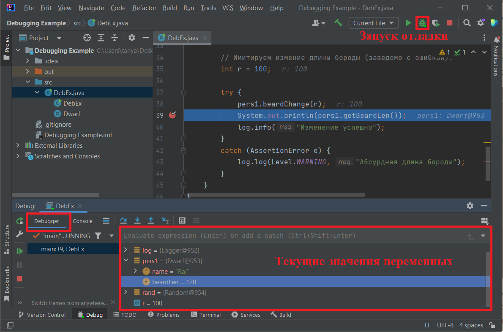
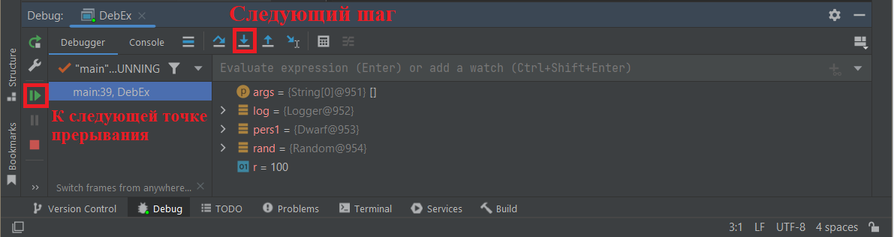
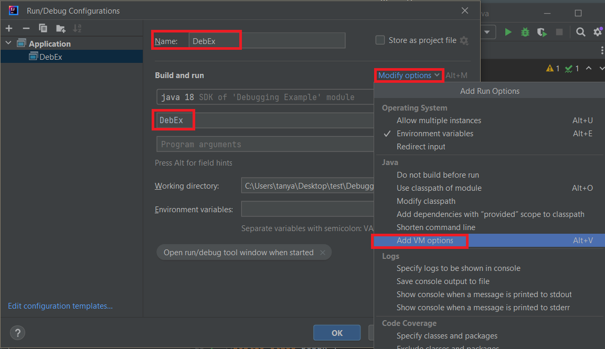
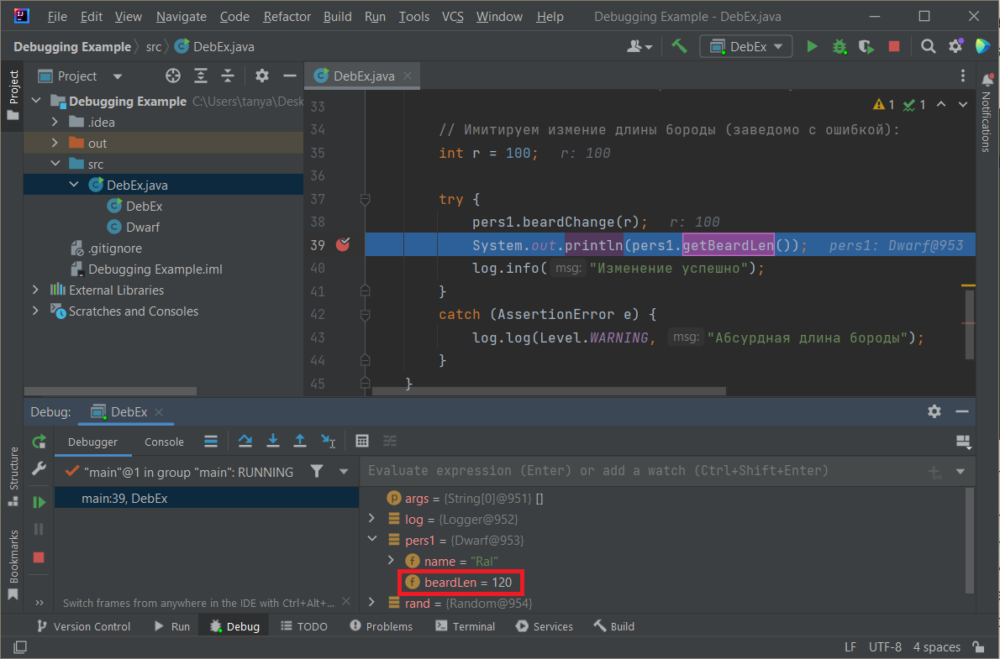
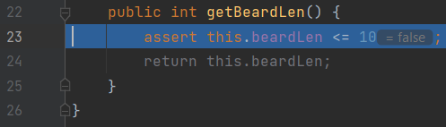

## Работа с breakpoints и asserts в IntelliJ IDEA

_В данном файле рассмотрен процесс отладки, а также спользование assert-ов на примере [кода](https://github.com/tatyana86/jv1/blob/main/DebEx.java) в среде разработки IntelliJ IDEA._

Обычный запуск программы выполяется с помощью клавиш ```Shift + F10``` или специальной кнопки (см. рис.).
Результат выполнения программы будет в консоли приложения внизу:



### Точки прерывания (breakpoints)
Чтобы иметь возможность остановиться на каком-то моменте выполнения кода и посмотреть текущее значение переменных, можно воспользоваться точками прерывания. Для этого необходимо кликнуть справа от номера строки, после чего появится красный кружок:



После этого можно запустить отладчик с помощью клавиш ```Shift + F9``` или специальной кнопки (см. рис.).  После этого программа автоматически выполнится до той строчки, на которой была установлена точка прерывания.
Во вкладке __Debugger__ снизу можно посмотреть значения переменных в текущий момент времени:



После этого можно продолжить вполнение построчно с помощью команды __Step Into__ (```F7```) или перейти к следующей точке прерывания, если таковая присутствует:



Таким образом, можно узнать значения переменных в любой момент выполнения программы.
Чтобы выполнить пошаговую отладку всей программы, можно установить точку прерывания на самой первой команде и выполнять команду __Step Into__ до ее завершения.

### Отладочная команда assert

Данная команда позволяет избежать абсурдных промежуточных состояний переменных в процессе работы с ними.
Рассмотрим фрагмент кода программы:

```public int getBeardLen() {
    assert this.beardLen <= 10;
    return this.beardLen;
}
```
В данном методе-геттере производится проверка состояния переменной _beardLen_, которая может может изменяться в методе _beardChange_. Подразумевается, что данная переменная не может превысить 10 единиц. Представим, что такая ситуация абсурдна для данной переменной, например, если изменение (как в +, так и в -) длины происходит в сотых долях и не сможет вырасти до 10 в течении жизни персонажа. Однако, предположим, что каким-то образом удалось по ошибке передать методу _beardChange_ значение, большее, чем 10. Это - нештатная, абсурдная ситуация, поэтому передаваемый аргумент не проверяется обычным условным оператором.
В таком случае команда ```assert``` сгенерирует исключение и преостановит выполнение программы.

Поскольку количество ```assert```-ов в коде может быть очень большим, то проверки логического выражения будут сказываться на производительности работы программы. Поэтому по умолчанию строки с данной командой игнорируются, а выполнение команды не прерывается даже при ложном выражении.

Чтобы команды ```assert```-ов в среде разработки IntelliJ IDEA не игнорировались, необходимо выполнить следующую настройку:

1. В верхнем меню зайти в настройки конфигурации:
  __Run - Edit Configurations__
2. Добавить новую конфигурацию:
  __Add new - Application__
3. Указать имя класса, в котором учитывать строки с командой ```assert```.
4. Добавить опцию ```-ea``` (enable asserions):



После этого данные команды не будут игнорироваться.

Заметим, что значение переменной __r__ задано заведомо большим и приведет к ложном условию при проверке ```assert this.beardLen <= 10;```. После запуска кода с включенной настройкой по логу видно, что программа завершается c предупреждением, так как данное исключение перехватывается командой ```catch (AssertionError e)```.

Поставим точку прерывания и посмотрим, чему равно значение переменной _beardLen_ во время проверки ```assert```:



Значение равно 120. Далее переходим на следующий шаг - к вызову метода ```getBeardLen()```с аргументом 120, который приводит к ложному условию (120 > 10):



После этого генерируется исключение типа __AssertionError__, которое, как было сказано выше, перехватывается командой ```catch (AssertionError e)```.
