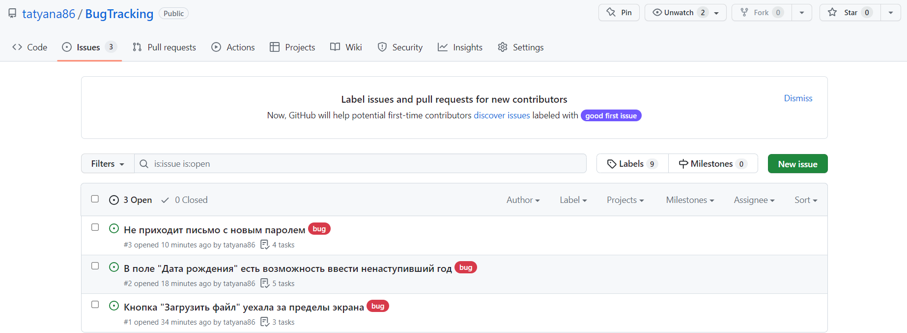
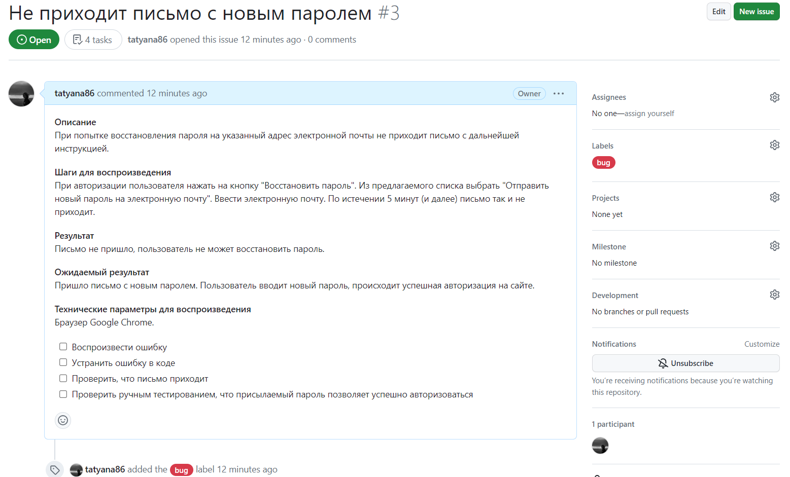
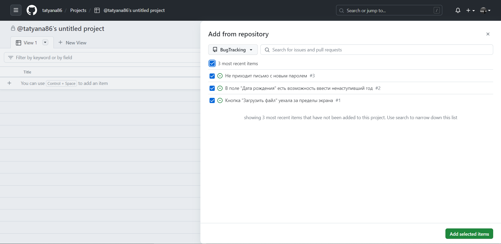
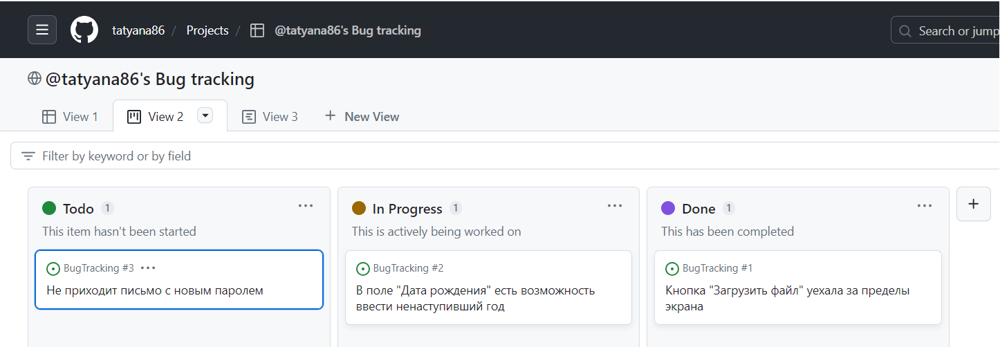
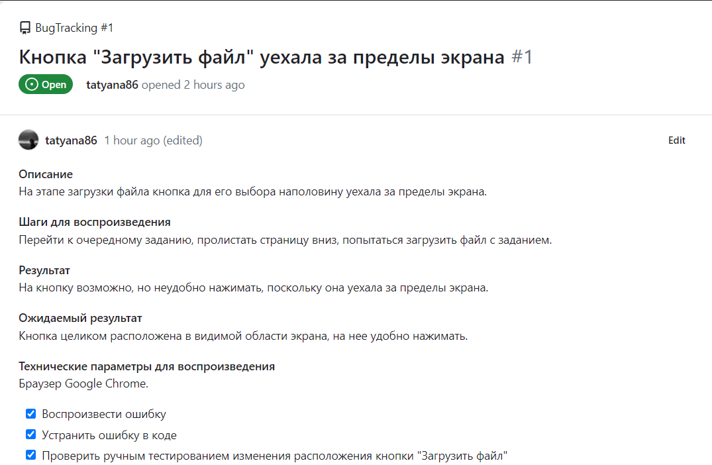

## Отчет по работе с системой управления проектами/задачами

_В ходе данной работы создан отдельный репозиторий "Отслеживание багов", в который в качестве примера добавлены три выявленных бага и прописаны задачи для их устранения. Далее создан __Project__, в который добавлены описанные ранее баги._

1. В созданном репозитории BugTracking добавлены три отчета (__Issues__):

  

2. Каждый отчет содержит следующую информацию:
- подробное описание;
- шаги для воспроизведения;
- результат;
- ожидаемый результат;
- технические параметры для воспроизведения.

Например, один из отчетов:

  

3. Далее был создан проект (__Project__), в который были добавлены отчеты из соответствующего репозитория:

  

  Также можно добавить новую задачу с помощью кнопки __Add Item__.

4. После этого баги будут отображаться в виде отдельных задач, которые можно группировать по статусу выполнения (Todo, In Progress, Done).

  

  Доступно несколько видов отображения задач: табличный, панельный и календарный.

5. При нажатии на отдельной задаче можно посмотреть ее подробное описание:

  
