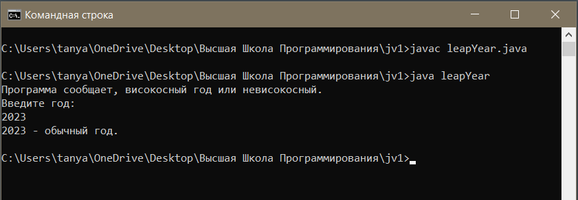

## Компиляция и запуск java-программы

_В данном тексте приведен алгоритм запуска java-программы из командной строки._

Имеем код программы, определяющий является ли введеный год високосным или нет:

```java
import java.util.Scanner;

public class leapYear {

    static boolean isLeap(int x) {
        // Год является високосным, если его номер кратен 4, но не кратен 100,
        // или если он кратен 400:
        if(x % 4 == 0 && x % 100 != 0 || x % 400 == 0)
            return true;
        return false;
    }

    public static void main(String[] args) {
        Scanner keyboard = new Scanner(System.in);
        int year; // год

        System.out.println("Программа сообщает, високосный год или невисокосный.");
        System.out.println("Введите год:");
        year = keyboard.nextInt();

        if(isLeap(year))
            System.out.println(year + " - високосный год.");
        else
            System.out.println(year + " - обычный год.");
    }
}
```
Имя файла должно соответствовать названию единственного public-класса. В данном случае - __leapYear.java__.
Далее открываем командную строку. Далее необходимо сделать 2 шага.

1. Прежде чем запустить программу, необходимо скомпилировать исходный код. Для этого необходимо перейти в директорию, где хранится файл (с помощью команды ```cd```), и выполнить команду:
```javac < имя-файла >```

   В данном случае: ```javac leapYear.java```

   Результат компиляции - байт-код с расширением __.class__, созданный в той же директории.

2. Теперь можно запустить код командой: ```java < имя-файла без расширения >```

    В данном случае: ```java leapYear```


  Пример выполнения компиляции и запуска файла в командной строке:

  

  В заключении ссылка на [основные элементы разметки MarkDown](https://github.com/adam-p/markdown-here/wiki/Markdown-Cheatsheet).
