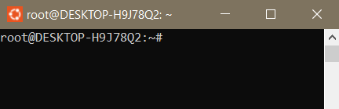
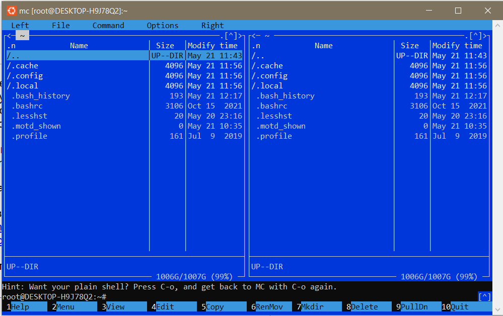
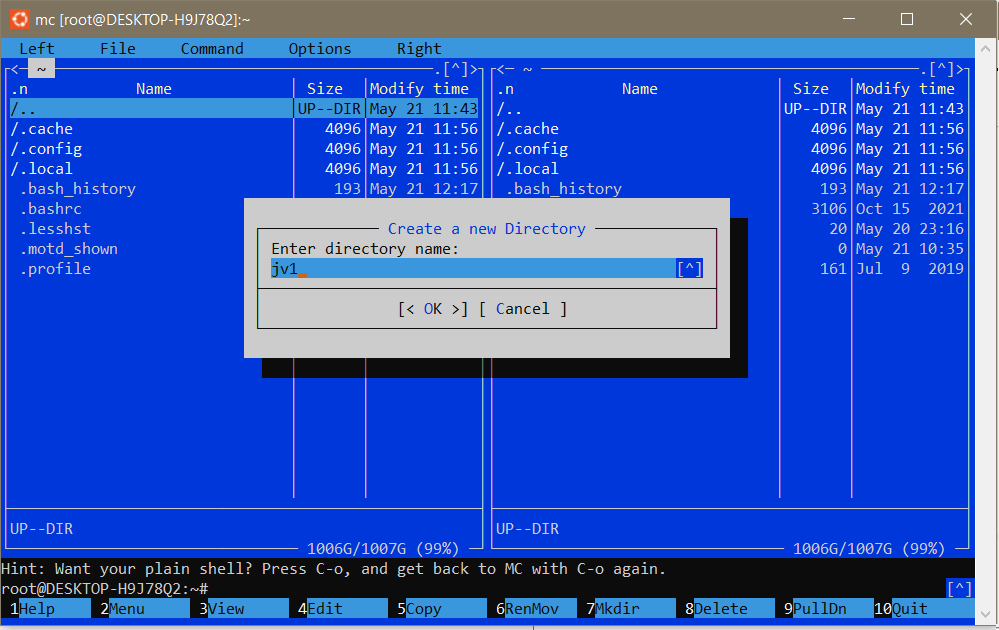
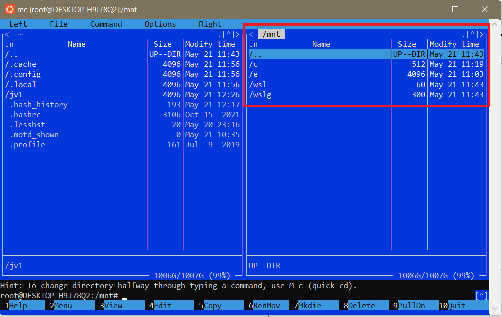
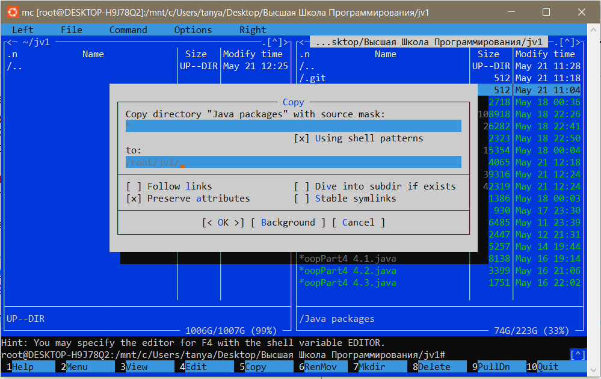
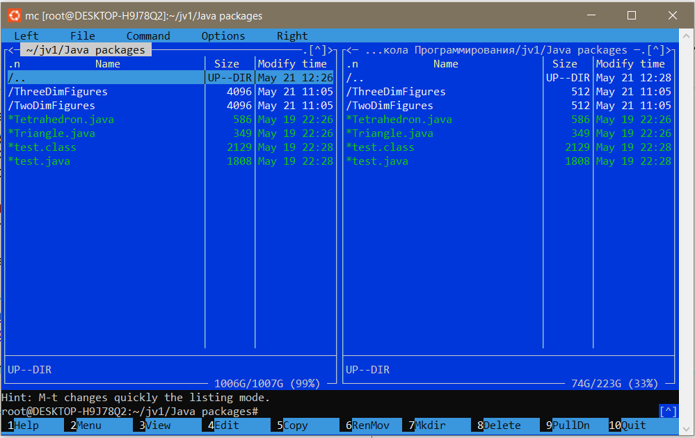
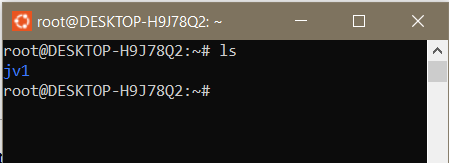
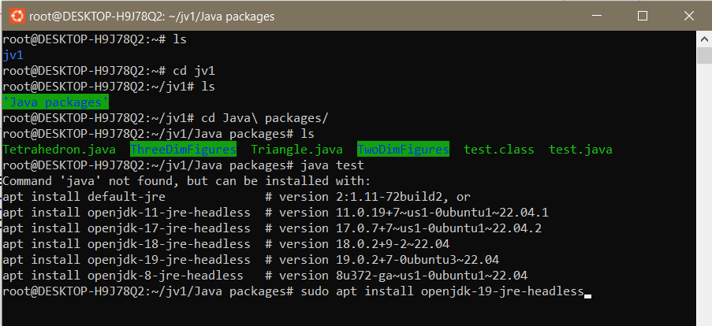
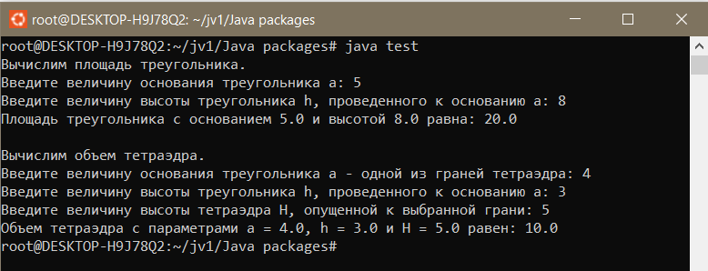

## Запуск java-программы в консоли встроенной Ubuntu WSL под Windows

_В файле приведен алгоритм запуска скомпилированного раннее [кода](https://github.com/tatyana86/jv1/blob/main/Compiling%20and%20running%20a%20java%20program.md) в консоли встроенной Ubuntu WSL под Windows._

После [установки Ubuntu WSL](https://ubuntu-admin.ru/ubuntu-wsl/) запустим программу:



Слово __root__ означает, что выполнен вход суперпользователя.

Запустим __midnight commander__ (аналог [far](https://github.com/tatyana86/jv1/blob/main/File%20manager%20Far.md)) с помощью команды ```mc```. Откроется файловый менеджер:



Видно, что в корневой папке располагаются только служебные файлы, о чем говорит точка перед названием файлов.

Создадим рабочую директорию для дальнейшей работы с помощью клавиши ```F7```:



Из Ubuntu WSL можно получить доступ к файлам, расположенным в Windows. Все доступные диски Windows расположены в директории _/mnt_:



Перейдем в директорию в Windows, где хранится папка с исходным и скомпилированным кодами. Далее скопируем ее в созданную ранее директорию в Ubuntu клавишей ```F5```:



Теперь папка с файлами ск опирована в Ubuntu WSL:



Закроем файловый менеджер клавишей ```F10``` и вернемся в консоль. Проверим, какие файлы есть в директории суперпользователя __root__ с помощью команды ```ls```. Видим единственную (нескрытую) ранее созданню папку __jv1__:



Перейдем в директорию с главным файлом _test.java_ и попытаемся запустить его:



Если это первый запуск java-программы, то необходимо установить JDK. Для последней предлагаемой версии 19 это можно сделать командой ```sudo apt install openjdk-19-jre-headless```.
После успешной установки вновь запустим программу:


