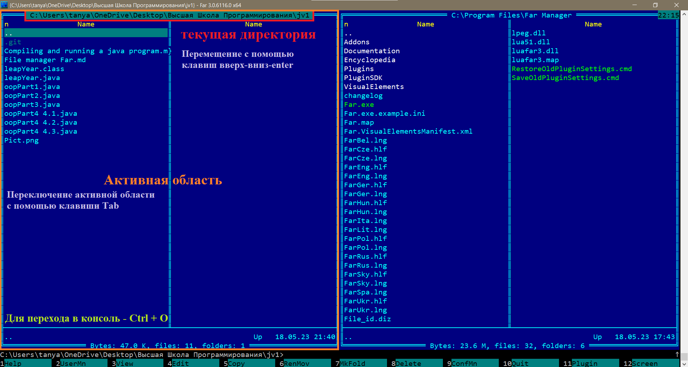
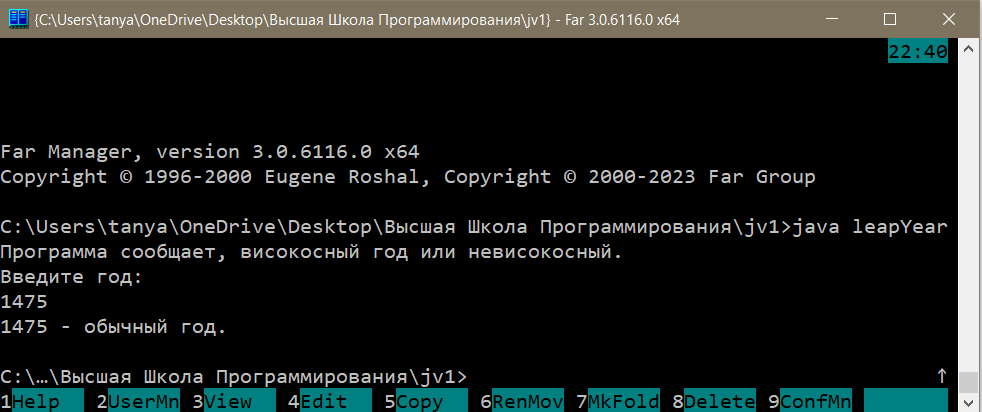

## Компиляция и запуск java-программы в консоли файлового менеджера Far

_В данном файле приведен алгоритм запуска скомпилированного раннее [кода](https://github.com/tatyana86/jv1/blob/main/Compiling%20and%20running%20a%20java%20program.md) в консоли файлового менеджера Far._

После запуска программы необходимо перейти в каталог, в котором хранится скомпилированный байт-файл.

Чтобы изменить диск левой или правой области, можно воспользоваться командой ```Alt + F1/F2```. Переключение между областями осуществляется клавишей ```Tab```.

Для перемещения между каталогами используются клавиши __вверх-вниз-enter__.

Окно программы после выбора необходимой директории с файлом принимает следующий вид:



Далее необходимо открыть встроенную консоль с помощью команды ```Ctrl + O```.

В консоли директория будет соответствовать текущему расположению, в котором оказались ранее с помощью менеджера. Запустить выполнение программы можно с помощью команды ```java leapYear```.

После этого выполнится программа, аналогично тому, как если бы она была запущена в обычной командной строке (cmd). Пример запуска файла в консоли:



Выход из консоли обратно в менеджер осуществляется аналогичной для входа командой: ```Ctrl + O```.

Закрытие программы можно выполнить с помощью команды ```F10```, подтвердив выход.
